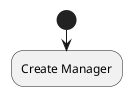
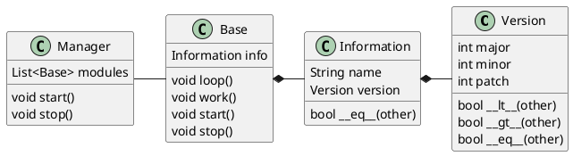

```plantuml
@startuml
start
:Create Manager;
@enduml
```

A module should be able to run without any of their dependencies being currently satisfied.

```plantuml

@startuml
class Version {
    int major
    int minor
    int patch
    
    bool __lt__(other)
    bool __gt__(other)
    bool __eq__(other)
}

class Information {
    String name
    Version version
    
    bool __eq__(other)
}

class Base {
    Information info
    
    void loop()
    void work()
    void start()
    void stop()
}

class Manager {
    List<Base> modules
    
    void start()
    void stop()
}

Manager - Base
Base *- Information

Information *- Version
@enduml

```